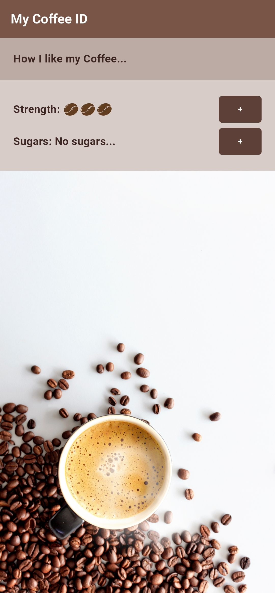

# Coffee App ☕

A simple Flutter app that lets you customize your coffee preferences, including strength and sugar levels. The app features a clean and intuitive UI with a coffee-themed design.

## Features
- **Customize Coffee Strength**: Adjust the strength of your coffee by adding or removing coffee beans.
- **Customize Sugar Levels**: Add or remove sugar cubes to match your preferred sweetness.
- **Responsive Design**: The app adapts to different screen sizes and orientations.
- **Coffee-Themed UI**: Enjoy a visually appealing design with coffee-inspired colors and images.

## Screenshots
 

## Getting Started

### Prerequisites
- Flutter SDK installed on your machine. If not, follow the [official Flutter installation guide](https://flutter.dev/docs/get-started/install).
- An IDE (e.g., Android Studio, VS Code) with Flutter and Dart plugins installed.

### Installation
1. Clone the repository:
   ```bash
   git clone https://github.com/seifsheikhelarab/coffee-app.git
   ```
2. Navigate to the project directory:
   ```bash
   cd coffee-app
   ```
3. Install dependencies:
   ```bash
   flutter pub get
   ```
4. Run the app:
   ```bash
   flutter run
   ```

### Project Structure
- `main.dart`: The entry point of the app. Initializes the `MaterialApp` and sets the `Home` widget as the home screen.
- `home.dart`: Contains the `Home` widget, which defines the app's main layout, including the app bar and body.
- `coffee_prefs.dart`: Contains the `CoffeePrefs` widget, which allows users to customize coffee strength and sugar levels.
- `styled_body_text.dart`: A reusable `StyledBodyText` widget for consistent text styling.
- `styled_button.dart`: A reusable `StyledButton` widget for consistent button styling.
- `assets/img/`: Contains images used in the app (e.g., coffee beans, sugar cubes, background).

### How to Use
1. Open the app.
2. On the home screen, you'll see two sections:
   - **How I like my Coffee...**: Displays your current coffee preferences.
   - **Strength**: Adjust the coffee strength by tapping the `+` button. Each tap adds a coffee bean (up to 5 beans).
   - **Sugars**: Adjust the sugar level by tapping the `+` button. Each tap adds a sugar cube (up to 5 cubes). Tap to reset to no sugar.
3. Enjoy your customized coffee preferences!

### Dependencies
This app uses the following Flutter packages:
- `flutter/material.dart`: For building the UI components.
- No additional third-party packages are used.

---

## Releases

Pre-built versions of the app are available for **Web**, **Windows**, and **Android**. Download the latest release from the links below:

### Web
- [Live Web App](https://your-web-app-url.com)
- Download builds from the Releases section of the repository

---


### License
This project is licensed under the MIT License. See the [LICENSE](LICENSE) file for details.

---

Made with ❤️ and ☕ by Seif Sheikhelarab. Enjoy your coffee!
